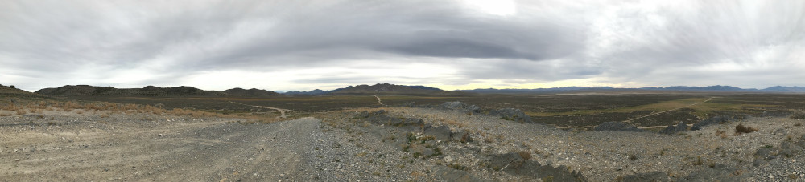

### Chapter 3 - Yamaha Introduces the TW200

The year was 1987. The Simpsons. China's first Kentucky Fried Chicken. The Nike Air Max. Photoshop for the Mac. 1987 was a memorable year for many reasons.

1987 was also the year that Yamaha introduced the TW200, also known as the Trailway (the Trailway name was dropped in 2001). The TW200 was first introduced in Japan, then North America and later Europe.

## Marketing

Originally marketed as the Yamaha Trailway (TW 200), the TW was introduced as the street-legal version of the Big Wheel 200 (BW200). Both bikes shared a number of characteristics, including a 200cc engine, wide tires, a square headlight and low seat height. The BW200 designed as an off-road bike, and at first glance from the side could be mistaken for a three-wheeler. It had a short life span of only 5 years (1985 to 1989).

Yamaha could see the writing on the wall for ATV-style motorcycles, but instead of allowing the competition to eat their lunch, they refined the BW200's form factor to make it street legal to target a wider number of audiences. The TW200 was marketed to appeal to those who wanted something they could ride both on and off road. The ideal rider would be someone who sometimes went off road, and even off trail. Farmers and ranchers needed such a machine to check on the livestock and change sprinklers. Weekend warriors wanted something that allowed them to run around town on any given weekday while having the ability to ride some trails, whether wet or dry, on the weekend. The utility of the TW200 ended up pretty much selling itself and leading to a 34+ year run (at the time of this writing).

## Pricing

The 1987 Yamaha had a low selling point of $1699, which was well within the budget of those looking for a street-legal bike. Over the years, there have been a few price bumps, with the current manufacturer's suggested retail price (MSRP) sitting at $4799 for the 2022 model.

## Reception

At first, the reception was lukewarm. The wide rear tire and signal lights confused some who were looking for either a dirt bike or a street bike. Even today, I get stares from people as I drive past, probably wondering if it is a some type of street bike with a custom rear tire. It's low-horsepower 200cc engine raises eyebrows among both on and off road bikers, who might not want to ride anything with less than 250ccs.

When comparing other Yamaha motorcycles with similar production runs, the SR400 is the only bike that currently holds the record of 43 consecutive years (1978-2021). If the TW200's current popularity carries, it could very well extend beyond the SR400's 43 year run.

## Competition

Because the TW200 fits in the dual-sport category, it can be compared to other dual-sport bikes, dirt bikes, and road bikes. When compared to the competition, the TW200 fails in a number of ways. It's low gear ratio hurts its rankings for road use, it's small engine and low ground clearance hurts its rankings for off road and dual-sport use, but it finds its niche for riders who want to do more off roading than on road but don't mind that it takes a little longer to get there.

In 2002 the Suzuki RV200 VanVan was released in North America. It looks similar to the TW200 with a smaller diameter tire in the front and a wider tire in the back. Stock tires on the RV200 are street, not knobby like the TW200. Its engine is similar in size and the VanVan is also street legal.

For off-roading, Yamaha's own BW200 with a similar square headlight look and wide tires was a competing product until it was discontinued in 1989.

## Uses

The TW has been marketed as an agricultural vehicle because of its low gear ratio and wide tires. It doesn't have the ground clearance (10 inches), large engine (196 cc) or suspension (6.3 inches in the front and 5.9 inches on the rear) of it's dirt bike cousins.

The TW is only distantly related to its street bike relatives. It has mirrors, headlamp, brake light/taillight and signal lights so it can be ridden on city streets, but because of its low gear ratio with a top speed of around 55 mph and stock off-road tires it's not suitable as a commuter or road bike.

What the TW does have, though, is versatility. Its stock knobby tires (narrower in the front, wider in the back) which provides a softer ride and the ability to ride from town into the hills, to the trails, and even off-trail no matter the terrain.

It can be used as a commuter bike if you're lucky enough to live close to work and can take either city streets or the backroads, and of course if you're a farmer or rancher.

## Resources

* https://bikeswiki.com/Yamaha_TW200
* https://bikeswiki.com/Suzuki_RV200_VanVan
* https://en.wikipedia.org/wiki/Yamaha_TW200
* https://en.wikipedia.org/wiki/Yamaha_SR400_%26_SR500
* https://www.globalsuzuki.com/motorcycle/products/vanvan200/
* https://www.topspeed.com/motorcycles/motorcycle-reviews/yamaha/1987-2008-yamaha-tw200-ar42127.html
* https://www.tw200forum.com/threads/cycle-world-september-1987-tw200-article.6254
* http://yamaha.itgo.com/BW200review/1.htm

[Next >>](050-chapter-04.md)
