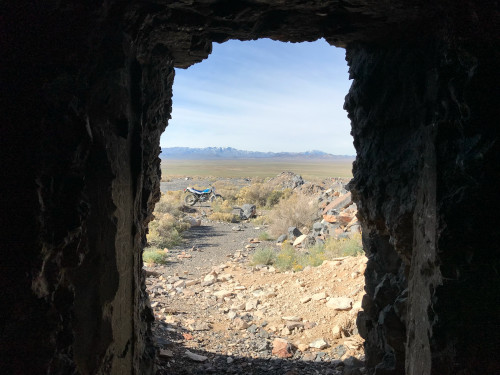

## Chapter 5 - Evolution

One of the unique things about the TW is how little it has changed since its introduction. The same square headlight, tires and engine have been features of the TW with little to no variation. The one thing that has changed almost each year is the color scheme. Two of the most drastic changes were in 2001 when the kickstarter was removed and front drum brake was replaced with a disc brake.

## Dimensions

The dimensions of the TW frame changed slightly starting with the 2001 model.

_**Table 5-1**_ Dimensions 1987-2000

| Dimension | Years: 1987-2000 | 2001-Present |
|---|---|---|
| Length | 81.1 inches | 82.3 inches |
| Width | 32.7 inches | 32.3 inches |
| Height | 45.7 inches | 44.1 inches |
| Seat height | 31.1 inches | 31.1 inches |
| Wheelbase | 52.2 inches | 52.2 inches |
| Ground clearance | 10.2 inches | 10.4 inches |
| Curb weight | 278 lbs | 278 lbs |

## Color Schemes

Though very little has changed on the TW year after year, Yamaha has changed the color scheme, sometimes in small and other times in large ways. In the table below, I've listed the colors for each year.

_**Table 5-2**_ Color Schemes by Year

| Year | Colors: Tank | Tank Lettering | Fender | Seat | Rims |
|---|---|---|---|---|---|
| 1987 | white | blue/red | white | blue/red | silver |
| 1988 | white/black | red | white | red | silver |
| 1989 | black/dark blue | red/yellow | black | red/blue | silver |
| 1990 | green | yellow | grey | green/black | silver |
| 1991 | dark blue/black | purple/yellow | black/white | dark blue/light blue | silver |
| 1992 | black/white | purple/yellow | black/white | blue/light blue | silver |
| 1993 | white | blue | white | blue | silver |
| 1994 | purple | yellow | purple | red | silver |
| 1995 | purple | yellow | purple | orange | silver |
| 1996 | white | yellow | white | blue | silver |
| 1997 | white | red | white | blue | silver |
| 1998 | white | white | whit | blue | silver |
| 1999 | white | blue | white | black/blue | silver |
| 2000 | white | blue | white | blue | silver |
| 2001 | white | blue/black | white | two-tone black/blue | silver |
| 2002 | white | blue/black | white | two-tone black/blue | silver |
| 2003 | silver/white | blue/black | white | two-tone black/blue black/silver | black |
| 2004 | silver | graphic only | black | two-tone black/silver | black |
| 2005 | silver | graphic only | black | two-tone black/silver | black |
| 2006 | two-tone black/blue | graphic only | black | two-tone black/silver black/blue | silver |
| 2007 | white | graphic only | blue | two-tone black/silver black/blue | silver |
| 2008 | white | graphic only | white | black | black |
| 2009 | white | graphic only | white | black | black |
| 2010 | white | graphic only | white | black | black |
| 2011 | white | graphic only | white | black | black |
| 2012 | white | graphic only | white | black | black |
| 2013 | white | graphic only | white | black | black |
| 2014 | blue/white | graphic only | white | black | black |
| 2015 | silver | white | white | black | black |
| 2016 | dark blue | white | white | black | black |
| 2017 | dark blue | white | white | black | black |
| 2018 | black | black with white background | brown | black | black |
| 2019 | black | black with white background | brown | black | black |
| 2020 | black | black with white background | brown | black | black |
| 2021 | black | white with black background | black | black | black |
| 2022 | black | black with white background | black | black | black |

## Modifications by Year

Besides color changes, there were a number of upgrades that Yamaha has made throughout the TW's lifecycle. The most significant year was 2001 when the kickstarter became an optional item, the front brake was switched from drum to disc, a trip odometer was added and the carburetor was modified.

_**Table 5-3**_ Modifications by Year

| Year | Modification(s) |
|---|---|
| 1988 | Modified electrical system |
| 1991 | Front brake shoe size adjustment |
| 1996 | Removed front fork drain screws |
| 2001 | Trip odometer added, electrical connector changes, handlebar controls updated, modified throttle cables, modified carb and throttle tubes, automatic cam chain adjuster, charging system bumped from 35W to 55W, CV carburetor with throttle cables on the other side, inlet manifold dimensions changed, kickstarter assembly removed, modified exhaust mounting |
| 2002 | Smaller fuel cap |
| 2009 | Leaking gasket problem resolved |
| 2015 | Spoke diameters changed |
| 2017 | Rear suspension was modified to make adjustments easier |
| 2018 | Muffler mounting moved further inside the frame, tail light mounts moved |

## Pricing

_**Table 5-4**_ Manufacturer's Suggested Retail Price by Year

| Year | USD |
|---|---|
| 1987 | $1699 |
| 2013 | $4590 |
| 2021 | $4799 |

## Accessories

Because the frame has remained unmodified for so many years, there are a number of first and third party accessories available that will fit nearly any TW model. These accessories vary from front and rear racks to skid plates.

Here's a list of accessories and some of the companies that manufacture each.

_**Table 4-1**_ Accessories

| Type | Manufacturer(s) |
|---|---|
| Front luggage rack | Cycleracks |
| Rear luggage rack | Cycleracks, Tusk, Yamaha |
| Skid plate | Ricochet |
| Handlebar riser | Tusk |
| Sprockets | Various |

## Resources

* https://bikeswiki.com/Yamaha_TW200
* https://www.motorcyclespecs.co.za/model/yamaha/yamaha_tw200%2089.htm
* https://www.tw200forum.com/threads/cycle-world-september-1987-tw200-article.6254/
* https://www.tw200forum.com/threads/tdubs-by-year-a-photo-collection.10362/
* https://www.tw200forum.com/threads/changes-by-year-to-the-usa-tw200.59330/
* https://www.yamahamotorsports.com/dual-sport/models/tw200

[Next >>](070-chapter-06.md)
